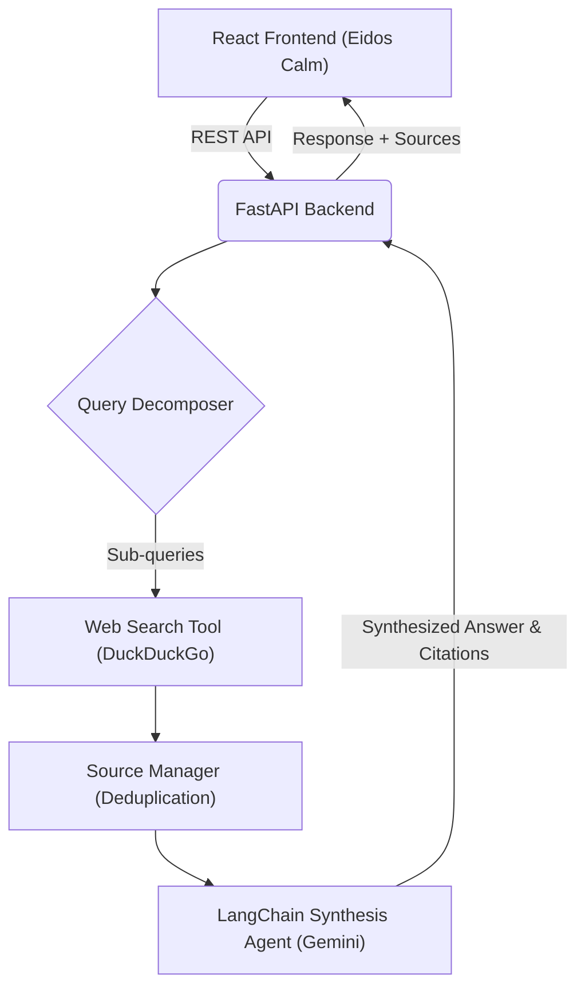

# RAGFlow: AI Research Assistant

RAGFlow is an intelligent research assistant that decomposes complex questions, gathers authoritative sources from the web, and synthesizes coherent, cited answers using advanced LLMs.

## Architecture



## Quick Start

### 1. Backend Setup
```bash
cd backend
python3 -m venv .venv
source .venv/bin/activate
pip install -r requirements.txt
```
Create a `.env` file in the `backend/` folder running `GOOGLE_API_KEY=your_key`.
Start the API: 
```bash
uvicorn main:app --reload
```

### 2. Frontend Setup
```bash
cd frontend
npm install
npm run dev
```

### Example API Request
```bash
curl -X POST http://localhost:8000/ask \
  -H "Content-Type: application/json" \
  -d '{"question": "What are the long-term benefits of renewable energy?"}'
```

## Technologies
- **Backend:** FastAPI, Python, LangChain, Google Gemini, DuckDuckGo Search
- **Frontend:** React, Vite, Custom Vanilla CSS

## License
MIT
