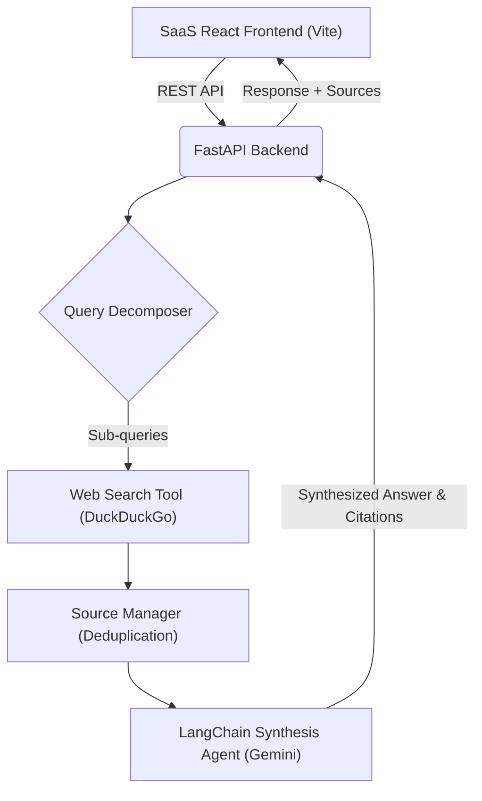

# RAGFlow: Premium SaaS AI Research Assistant

RAGFlow is a high-performance, production-grade AI research assistant that decomposes complex queries, synthesizes authoritative web insights, and delivers answers in a **world-class SaaS interface**.

##  Features & UX Refinements

###  SaaS-Grade UI/UX
- **Glassmorphism Redesign**: Every chat bubble features high-fidelity `backdrop-filter: blur()` and low-opacity borders with premium depth.
- **Floating Input Dock**: A modern, pill-shaped floating message bar that anchors the interaction experience.
- **Indigo/Charcoal Palette**: A professionally curated design system featuring deep charcoal backgrounds and vibrant indigo accents.

###  Interactive Experience
- **Simulated Streaming**: Character-by-character response streaming for a humanized, "real-time" interaction feel.
- **Micro-animations**: Powered by **Framer Motion**, including message fade-ins, button "lift" hover effects, and a pulsing typing indicator.
- **Tactile Feedback**: Every interaction features soft shadows and smooth transitions for a premium SaaS feel.

###  Core Functionality
- **Persistent Chat History**: LocalStorage-based conversation management with auto-titling, renaming, and deletion.
- **Rich Formatting**: Full **Markdown** support with **Prism.js** for professional syntax highlighting and code block rendering.
- **Smart Sourcechips**: Dedicated UI for authoritative sources, rendered as distinct interactive chips.

---

##  Architecture


```mermaid
graph TD
    A["SaaS React Frontend (Vite)"] -->|REST API| B("FastAPI Backend")
    B --> C{"Query Decomposer"}
    C -->|"Sub-queries"| D["Web Search Tool (DuckDuckGo)"]
    D --> E["Source Manager (Deduplication)"]
    E --> F["LangChain Synthesis Agent (Gemini)"]
    F -->|"Synthesized Answer & Citations"| B
    B -->|"Response + Sources"| A
```

---

##  Quick Start

### 1. Backend Setup (Port 8000)
```bash
cd backend
python3 -m venv .venv
source .venv/bin/activate
pip install -r requirements.txt
```
> [!NOTE]
> Create a `.env` file in the `backend/` folder with `GOOGLE_API_KEY=your_key`.

Start the API: 
```bash
uvicorn main:app --reload
```

### 2. Frontend Setup (Port 5174)
```bash
cd frontend
npm install
npm run dev
```

The application will be live at: **[http://localhost:5174/](http://localhost:5174/)**

---

## ⚙️ Technologies
| Component | Tech Stack |
| --- | --- |
| **Frontend** | React 18, Vite, Framer Motion, Prism.js, Lucide Icons |
| **Styling** | Vanilla CSS (Zero Tailwind) with custom Design System |
| **Assistant** | LangChain, Google Gemini Pro 1.5 |
| **Backend** | FastAPI, DuckDuckGo-Search, Python 3.10+ |

---
## License
MIT
